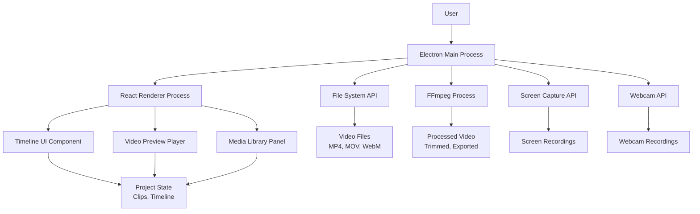
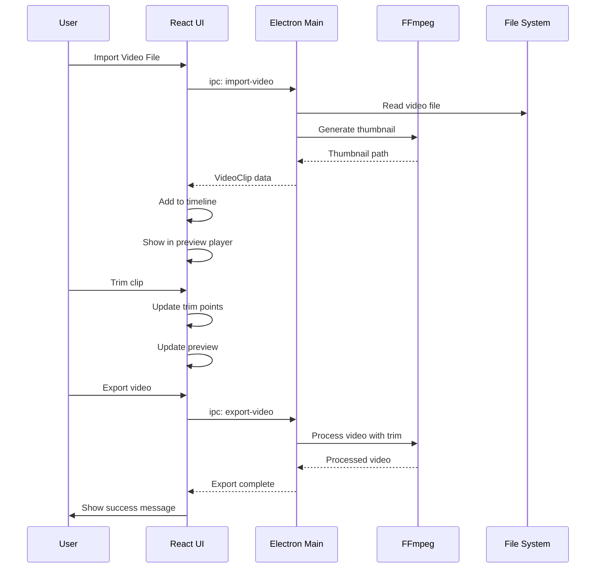
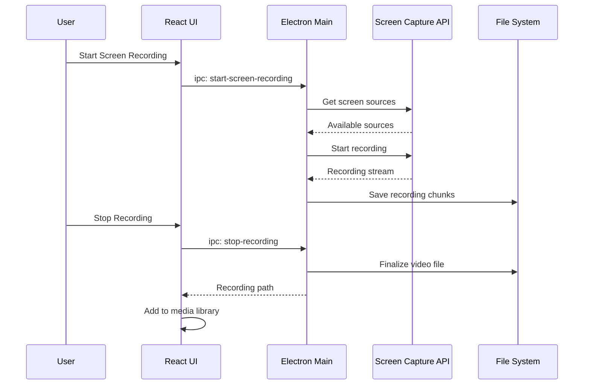
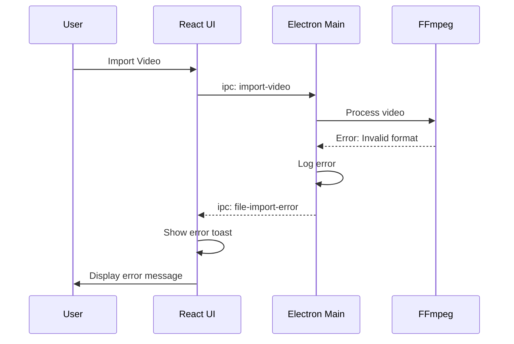

# ClipForge Fullstack Architecture Document

## Introduction

This document outlines the complete fullstack architecture for **ClipForge**, including backend systems, frontend implementation, and their integration. It serves as the single source of truth for AI-driven development, ensuring consistency across the entire technology stack.

This unified approach combines what would traditionally be separate backend and frontend architecture documents, streamlining the development process for modern fullstack applications where these concerns are increasingly intertwined.

### Starter Template or Existing Project

**N/A - Greenfield project**

This is a new Electron desktop application project with no existing codebase or starter template dependencies.

### Change Log

| Date       | Version | Description              | Author   |
| :--------- | :------ | :----------------------- | :------- |
| 2025-01-27 | 1.0     | Initial architecture draft | Architect Winston |

---

## High Level Architecture

### Technical Summary

ClipForge is a **native desktop video editor** built using **Electron + React** with a **monolithic desktop application architecture**. The frontend uses React with TypeScript for the UI layer, while the backend leverages Node.js APIs for file system access, media processing via FFmpeg, and native OS integration for screen/webcam recording. The application integrates FFmpeg for video processing, Canvas-based timeline UI for performance, and HTML5 video elements for preview. This architecture achieves the PRD goals by providing a single packaged desktop application that handles the complete video editing workflow (record → import → arrange → export) with native performance and intuitive UI inspired by CapCut.

### Platform and Infrastructure Choice

**Platform:** Native Desktop (Electron)
**Key Services:** File System API, Media Processing (FFmpeg), Screen Capture API, Webcam API
**Deployment Host and Regions:** Local packaging for macOS (.dmg) and Windows (.exe)

**Rationale:**
- **Electron** chosen over Tauri for React familiarity and faster development
- **No cloud infrastructure** needed - fully local desktop application
- **FFmpeg** for industry-standard video processing
- **Native APIs** for screen/webcam recording capabilities

### Repository Structure

**Structure:** Monorepo
**Monorepo Tool:** npm workspaces
**Package Organization:** 
- `apps/electron` - Main Electron application
- `apps/renderer` - React frontend
- `packages/shared` - Shared TypeScript types and utilities
- `packages/ui` - Shared UI components

### High Level Architecture Diagram



### Architectural Patterns

- **Monolithic Desktop Application:** All functionality contained within single packaged app - _Rationale:_ Simplifies deployment and meets 72-hour deadline constraints
- **Component-Based UI:** React components with TypeScript for maintainability - _Rationale:_ Familiar stack enables rapid development
- **Canvas-Based Timeline:** Custom timeline UI using HTML5 Canvas - _Rationale:_ Performance critical for video editing with multiple clips
- **Process Separation:** Electron main process handles heavy operations (FFmpeg, file I/O) - _Rationale:_ Prevents UI blocking during video processing
- **Event-Driven Architecture:** IPC communication between main and renderer processes - _Rationale:_ Clean separation of concerns and responsive UI
- **Repository Pattern:** Abstracted data access for project state management - _Rationale:_ Enables testing and future persistence options

---

## Tech Stack

This is the **DEFINITIVE technology selection** for the entire ClipForge project. All development must use these exact versions.

### Technology Stack Table

| Category | Technology | Version | Purpose | Rationale |
|----------|------------|---------|---------|-----------|
| Frontend Language | TypeScript | 5.3+ | Type safety and developer experience | Prevents runtime errors, improves IDE support |
| Frontend Framework | React | 18.2+ | UI component library | Familiar, excellent ecosystem, fast development |
| UI Component Library | Radix UI + Tailwind | Latest | Accessible components + styling | Radix provides accessible primitives, Tailwind for rapid styling |
| State Management | Zustand | 4.4+ | Lightweight state management | Simple API, TypeScript support, minimal boilerplate |
| Backend Language | Node.js | 20+ | Electron main process | Native integration, extensive ecosystem |
| Backend Framework | Electron | 28+ | Desktop application framework | Cross-platform, web technologies, native APIs |
| API Style | IPC (Inter-Process Communication) | Built-in | Main ↔ Renderer communication | Electron's native communication method |
| Database | File System (JSON) | N/A | Project file storage | Simple MVP implementation, no external dependencies |
| Cache | Browser Cache + Memory | N/A | Video thumbnails, UI state | Browser handles video caching, memory for app state |
| File Storage | Local File System | Native | Video files, project files | Desktop app stores everything locally |
| Authentication | None (MVP) | N/A | No auth needed for MVP | Desktop app, single user, no cloud features |
| Frontend Testing | Manual Testing | N/A | Manual testing for MVP | Faster than automated setup for 72-hour timeline |
| Backend Testing | Manual Testing | N/A | Manual testing for MVP | Focus on core functionality |
| E2E Testing | Manual Testing | N/A | Manual testing for MVP | User workflow validation |
| Build Tool | Vite | 5+ | Frontend build tool | Fast development, excellent TypeScript support |
| Bundler | Electron Builder | Latest | Desktop app packaging | Industry standard for Electron packaging |
| IaC Tool | N/A | N/A | No infrastructure needed | Desktop application, no cloud deployment |
| CI/CD | Manual Build | N/A | Manual packaging for MVP | Focus on core functionality |
| Monitoring | Console Logging | N/A | Basic error tracking | MVP approach, can add Sentry later |
| Logging | Console + File | N/A | Development and debugging | Simple file-based logging for desktop app |
| CSS Framework | Tailwind CSS | 3.4+ | Utility-first CSS framework | Rapid styling, consistent design system |

---

## Data Models

Define the core data models/entities for ClipForge video editing:

### Project

**Purpose:** Represents a complete video editing project containing all clips, timeline configuration, and export settings.

**Key Attributes:**
- `id`: string - Unique project identifier
- `name`: string - Project display name
- `createdAt`: Date - Project creation timestamp
- `modifiedAt`: Date - Last modification timestamp
- `timeline`: Timeline - Timeline configuration and clips
- `exportSettings`: ExportSettings - Default export configuration

#### TypeScript Interface
```typescript
interface Project {
  id: string;
  name: string;
  createdAt: Date;
  modifiedAt: Date;
  timeline: Timeline;
  exportSettings: ExportSettings;
}
```

#### Relationships
- Contains one Timeline
- Contains one ExportSettings
- References multiple VideoClip entities

### VideoClip

**Purpose:** Represents an imported video file with metadata and trim points.

**Key Attributes:**
- `id`: string - Unique clip identifier
- `filePath`: string - Path to source video file
- `name`: string - Display name for the clip
- `duration`: number - Total duration in seconds
- `width`: number - Video width in pixels
- `height`: number - Video height in pixels
- `fps`: number - Frames per second
- `trimStart`: number - Start trim point in seconds
- `trimEnd`: number - End trim point in seconds
- `thumbnailPath`: string - Path to thumbnail image

#### TypeScript Interface
```typescript
interface VideoClip {
  id: string;
  filePath: string;
  name: string;
  duration: number;
  width: number;
  height: number;
  fps: number;
  trimStart: number;
  trimEnd: number;
  thumbnailPath: string;
}
```

#### Relationships
- Belongs to Project
- Can be placed on TimelineTrack
- Has one Thumbnail

### Timeline

**Purpose:** Represents the editing timeline with tracks and playhead position.

**Key Attributes:**
- `duration`: number - Total timeline duration in seconds
- `playheadPosition`: number - Current playhead position in seconds
- `zoomLevel`: number - Timeline zoom level (1.0 = normal)
- `tracks`: TimelineTrack[] - Array of timeline tracks
- `snapToGrid`: boolean - Whether clips snap to grid
- `gridSize`: number - Grid size in seconds

#### TypeScript Interface
```typescript
interface Timeline {
  duration: number;
  playheadPosition: number;
  zoomLevel: number;
  tracks: TimelineTrack[];
  snapToGrid: boolean;
  gridSize: number;
}
```

#### Relationships
- Contains multiple TimelineTrack entities
- Belongs to Project

### TimelineTrack

**Purpose:** Represents a single track on the timeline that can contain video clips.

**Key Attributes:**
- `id`: string - Unique track identifier
- `name`: string - Track display name
- `type`: 'video' | 'audio' - Track type
- `clips`: TimelineClip[] - Clips placed on this track
- `muted`: boolean - Whether track is muted
- `volume`: number - Track volume (0.0 to 1.0)

#### TypeScript Interface
```typescript
interface TimelineTrack {
  id: string;
  name: string;
  type: 'video' | 'audio';
  clips: TimelineClip[];
  muted: boolean;
  volume: number;
}
```

#### Relationships
- Contains multiple TimelineClip entities
- Belongs to Timeline

### TimelineClip

**Purpose:** Represents a video clip placed on a timeline track with position and trim information.

**Key Attributes:**
- `id`: string - Unique timeline clip identifier
- `videoClipId`: string - Reference to source VideoClip
- `trackId`: string - ID of track this clip is on
- `startTime`: number - Start position on timeline in seconds
- `endTime`: number - End position on timeline in seconds
- `trimStart`: number - Trim start point in source clip
- `trimEnd`: number - Trim end point in source clip
- `selected`: boolean - Whether clip is currently selected

#### TypeScript Interface
```typescript
interface TimelineClip {
  id: string;
  videoClipId: string;
  trackId: string;
  startTime: number;
  endTime: number;
  trimStart: number;
  trimEnd: number;
  selected: boolean;
}
```

#### Relationships
- References VideoClip
- Belongs to TimelineTrack

### ExportSettings

**Purpose:** Configuration for video export including resolution, quality, and output format.

**Key Attributes:**
- `resolution`: '720p' | '1080p' | 'source' - Export resolution
- `quality`: 'low' | 'medium' | 'high' - Export quality preset
- `format`: 'mp4' - Output format (MP4 only for MVP)
- `fps`: number - Output frame rate
- `bitrate`: number - Video bitrate in kbps
- `audioBitrate`: number - Audio bitrate in kbps

#### TypeScript Interface
```typescript
interface ExportSettings {
  resolution: '720p' | '1080p' | 'source';
  quality: 'low' | 'medium' | 'high';
  format: 'mp4';
  fps: number;
  bitrate: number;
  audioBitrate: number;
}
```

#### Relationships
- Belongs to Project

---

## API Specification

Since ClipForge uses **IPC (Inter-Process Communication)** between Electron main and renderer processes, here's the API specification:

### IPC API Specification

**API Style:** Electron IPC (Inter-Process Communication)
**Communication Pattern:** Event-based messaging between main and renderer processes
**Authentication:** None (desktop application, single user)

#### Main Process → Renderer Process Events

```typescript
// File operations
interface FileEvents {
  'file-imported': { clip: VideoClip };
  'file-import-error': { error: string };
  'project-saved': { success: boolean };
  'project-loaded': { project: Project };
}

// Video processing
interface VideoEvents {
  'video-processed': { outputPath: string };
  'video-processing-progress': { progress: number };
  'video-processing-error': { error: string };
  'thumbnail-generated': { clipId: string; thumbnailPath: string };
}

// Recording
interface RecordingEvents {
  'recording-started': { success: boolean };
  'recording-stopped': { outputPath: string };
  'recording-error': { error: string };
}
```

#### Renderer Process → Main Process Events

```typescript
// File operations
interface FileCommands {
  'import-video': { filePath: string };
  'save-project': { project: Project };
  'load-project': { filePath: string };
  'export-video': { 
    project: Project; 
    outputPath: string; 
    settings: ExportSettings;
  };
}

// Video processing
interface VideoCommands {
  'generate-thumbnail': { clipId: string; videoPath: string };
  'trim-video': { 
    inputPath: string; 
    outputPath: string; 
    startTime: number; 
    endTime: number;
  };
}

// Recording
interface RecordingCommands {
  'start-screen-recording': { 
    source: 'fullscreen' | 'window'; 
    windowId?: string;
  };
  'start-webcam-recording': { deviceId: string };
  'stop-recording': void;
}
```

---

## Components

### ElectronMainProcess

**Responsibility:** Handles file system operations, video processing via FFmpeg, screen/webcam recording, and project persistence.

**Key Interfaces:**
- `importVideo(filePath: string): Promise<VideoClip>`
- `exportVideo(project: Project, outputPath: string, settings: ExportSettings): Promise<void>`
- `startScreenRecording(source: 'fullscreen' | 'window'): Promise<void>`
- `generateThumbnail(videoPath: string): Promise<string>`

**Dependencies:** FFmpeg, Node.js File System API, Electron APIs

**Technology Stack:** Node.js, Electron Main Process APIs, fluent-ffmpeg

### ReactRendererProcess

**Responsibility:** Manages the user interface, state management, and user interactions.

**Key Interfaces:**
- `render(): JSX.Element` - Main app rendering
- `handleUserInteraction(event: UserEvent): void` - User input handling
- `updateProjectState(updates: Partial<Project>): void` - State updates

**Dependencies:** ElectronMainProcess (via IPC), Zustand store

**Technology Stack:** React, TypeScript, Zustand, Tailwind CSS

### TimelineComponent

**Responsibility:** Renders the video editing timeline with tracks, clips, and playhead.

**Key Interfaces:**
- `renderTimeline(timeline: Timeline): JSX.Element`
- `handleClipDrag(clipId: string, newPosition: number): void`
- `handleTrim(clipId: string, start: number, end: number): void`
- `setPlayheadPosition(position: number): void`

**Dependencies:** Canvas API, Project state

**Technology Stack:** HTML5 Canvas, React, TypeScript

### VideoPreviewPlayer

**Responsibility:** Displays video preview synchronized with timeline playhead.

**Key Interfaces:**
- `playVideo(): void`
- `pauseVideo(): void`
- `seekToPosition(time: number): void`
- `setVideoSource(clip: VideoClip): void`

**Dependencies:** HTML5 Video API, Project state

**Technology Stack:** HTML5 Video, React, TypeScript

### MediaLibraryPanel

**Responsibility:** Shows imported video clips with thumbnails and metadata.

**Key Interfaces:**
- `displayClips(clips: VideoClip[]): JSX.Element`
- `handleClipSelect(clipId: string): void`
- `handleClipImport(): void`

**Dependencies:** File system, Thumbnail generation

**Technology Stack:** React, TypeScript, File System API

### ProjectManager

**Responsibility:** Handles project creation, saving, and loading operations.

**Key Interfaces:**
- `createNewProject(): Project`
- `saveProject(project: Project): Promise<void>`
- `loadProject(filePath: string): Promise<Project>`

**Dependencies:** File System API, Project state

**Technology Stack:** Node.js File System, JSON serialization

### FFmpegProcessor

**Responsibility:** Handles all video processing operations including trimming, export, and thumbnail generation.

**Key Interfaces:**
- `trimVideo(inputPath: string, outputPath: string, startTime: number, endTime: number): Promise<void>`
- `exportVideo(project: Project, outputPath: string, settings: ExportSettings): Promise<void>`
- `generateThumbnail(videoPath: string, outputPath: string): Promise<void>`

**Dependencies:** FFmpeg binary, File System

**Technology Stack:** fluent-ffmpeg, Node.js

### RecordingManager

**Responsibility:** Manages screen and webcam recording functionality.

**Key Interfaces:**
- `startScreenRecording(source: 'fullscreen' | 'window'): Promise<void>`
- `startWebcamRecording(deviceId: string): Promise<void>`
- `stopRecording(): Promise<string>`

**Dependencies:** Electron Screen Capture API, Webcam API

**Technology Stack:** Electron APIs, MediaRecorder API

---

## External APIs

**No External APIs Required**

ClipForge is a fully self-contained desktop application that does not require external API integrations for MVP functionality. All operations are handled locally:

- **Video Processing**: FFmpeg (bundled locally)
- **File Operations**: Local file system
- **Screen Recording**: Native OS APIs via Electron
- **Webcam Recording**: Native OS APIs via Electron
- **Project Storage**: Local JSON files

**Future Considerations:**
- Cloud storage integration (Google Drive, Dropbox) - Phase 2+
- Video sharing services (YouTube, Vimeo) - Phase 2+
- Stock media libraries - Phase 2+

---

## Core Workflows

### Import → Preview → Trim → Export Workflow



### Screen Recording Workflow



---

## Database Schema

Since ClipForge uses **file-based storage** with JSON files, here's the schema approach:

### Project File Schema

```json
{
  "version": "1.0",
  "project": {
    "id": "uuid-string",
    "name": "My Video Project",
    "createdAt": "2025-01-27T10:00:00Z",
    "modifiedAt": "2025-01-27T15:30:00Z",
    "timeline": {
      "duration": 120.5,
      "playheadPosition": 45.2,
      "zoomLevel": 1.0,
      "snapToGrid": true,
      "gridSize": 1.0,
      "tracks": [
        {
          "id": "track-1",
          "name": "Main Video",
          "type": "video",
          "muted": false,
          "volume": 1.0,
          "clips": [
            {
              "id": "clip-1",
              "videoClipId": "video-1",
              "startTime": 0,
              "endTime": 30.5,
              "trimStart": 5.0,
              "trimEnd": 35.5,
              "selected": false
            }
          ]
        }
      ]
    },
    "clips": [
      {
        "id": "video-1",
        "filePath": "/Users/user/Videos/sample.mp4",
        "name": "sample.mp4",
        "duration": 60.0,
        "width": 1920,
        "height": 1080,
        "fps": 30,
        "trimStart": 0,
        "trimEnd": 60.0,
        "thumbnailPath": "/Users/user/.clipforge/thumbnails/video-1.jpg"
      }
    ],
    "exportSettings": {
      "resolution": "1080p",
      "quality": "high",
      "format": "mp4",
      "fps": 30,
      "bitrate": 5000,
      "audioBitrate": 128
    }
  }
}
```

### File System Structure

```
~/.clipforge/
├── projects/
│   ├── project-1.json
│   └── project-2.json
├── thumbnails/
│   ├── video-1.jpg
│   └── video-2.jpg
├── temp/
│   ├── export-temp-1.mp4
│   └── processing-temp-2.mp4
└── recordings/
    ├── screen-recording-1.mp4
    └── webcam-recording-1.mp4
```

---

## Frontend Architecture

### Component Architecture

#### Component Organization
```
src/
├── components/
│   ├── ui/                    # Reusable UI components
│   │   ├── Button.tsx
│   │   ├── Modal.tsx
│   │   └── Slider.tsx
│   ├── timeline/              # Timeline-specific components
│   │   ├── Timeline.tsx
│   │   ├── TimelineTrack.tsx
│   │   ├── TimelineClip.tsx
│   │   └── Playhead.tsx
│   ├── preview/               # Video preview components
│   │   ├── VideoPlayer.tsx
│   │   └── PreviewControls.tsx
│   ├── media/                 # Media library components
│   │   ├── MediaLibrary.tsx
│   │   ├── ClipThumbnail.tsx
│   │   └── ImportDialog.tsx
│   └── export/                # Export components
│       ├── ExportDialog.tsx
│       └── ProgressBar.tsx
├── hooks/                     # Custom React hooks
│   ├── useProject.ts
│   ├── useTimeline.ts
│   └── useElectron.ts
├── stores/                    # Zustand stores
│   ├── projectStore.ts
│   ├── timelineStore.ts
│   └── uiStore.ts
├── services/                  # API services
│   ├── electronService.ts
│   └── ffmpegService.ts
└── types/                     # TypeScript types
    ├── project.ts
    ├── timeline.ts
    └── video.ts
```

### State Management Architecture

#### State Structure
```typescript
// projectStore.ts
interface ProjectState {
  currentProject: Project | null;
  clips: VideoClip[];
  timeline: Timeline;
  exportSettings: ExportSettings;
  isLoading: boolean;
  error: string | null;
}

// timelineStore.ts
interface TimelineState {
  playheadPosition: number;
  zoomLevel: number;
  selectedClips: string[];
  isPlaying: boolean;
  snapToGrid: boolean;
}

// uiStore.ts
interface UIState {
  activePanel: 'media' | 'timeline' | 'preview';
  sidebarWidth: number;
  showExportDialog: boolean;
  showImportDialog: boolean;
}
```

### Frontend Services Layer

#### API Client Setup
```typescript
// electronService.ts
import { ipcRenderer } from 'electron';

class ElectronService {
  async importVideo(filePath: string): Promise<VideoClip> {
    return new Promise((resolve, reject) => {
      ipcRenderer.send('import-video', { filePath });
      
      ipcRenderer.once('file-imported', (_, data) => {
        resolve(data.clip);
      });
      
      ipcRenderer.once('file-import-error', (_, data) => {
        reject(new Error(data.error));
      });
    });
  }

  async exportVideo(project: Project, outputPath: string, settings: ExportSettings): Promise<void> {
    return new Promise((resolve, reject) => {
      ipcRenderer.send('export-video', { project, outputPath, settings });
      
      ipcRenderer.once('video-processed', () => resolve());
      ipcRenderer.once('video-processing-error', (_, data) => {
        reject(new Error(data.error));
      });
    });
  }
}

export const electronService = new ElectronService();
```

---

## Backend Architecture

### Service Architecture

#### Function Organization
```
electron/
├── main.ts                    # Main process entry point
├── services/
│   ├── fileService.ts         # File system operations
│   ├── ffmpegService.ts       # Video processing
│   ├── recordingService.ts    # Screen/webcam recording
│   └── projectService.ts      # Project management
├── handlers/
│   ├── ipcHandlers.ts         # IPC event handlers
│   └── menuHandlers.ts        # Menu action handlers
├── utils/
│   ├── ffmpeg.ts             # FFmpeg utilities
│   ├── fileUtils.ts          # File system utilities
│   └── logger.ts             # Logging utilities
└── types/
    ├── ipc.ts                # IPC type definitions
    └── services.ts           # Service interfaces
```

### Database Architecture

#### Schema Design
```typescript
// projectService.ts
import { promises as fs } from 'fs';
import { join } from 'path';
import { app } from 'electron';
import { Project, VideoClip } from '../types/services';

export class ProjectService {
  private getProjectPath(projectId: string): string {
    const userDataPath = app.getPath('userData');
    return join(userDataPath, 'projects', `${projectId}.json`);
  }

  async saveProject(project: Project): Promise<void> {
    const projectPath = this.getProjectPath(project.id);
    const projectDir = join(projectPath, '..');
    
    await fs.mkdir(projectDir, { recursive: true });
    await fs.writeFile(projectPath, JSON.stringify(project, null, 2));
  }

  async loadProject(projectId: string): Promise<Project> {
    const projectPath = this.getProjectPath(projectId);
    const data = await fs.readFile(projectPath, 'utf-8');
    return JSON.parse(data);
  }
}
```

---

## Unified Project Structure

```
clip-forge-electron/
├── .github/                    # CI/CD workflows
│   └── workflows/
│       ├── ci.yaml
│       └── build.yaml
├── apps/                       # Application packages
│   ├── electron/               # Electron main process
│   │   ├── src/
│   │   │   ├── main.ts         # Main process entry
│   │   │   ├── services/       # Backend services
│   │   │   │   ├── fileService.ts
│   │   │   │   ├── ffmpegService.ts
│   │   │   │   ├── recordingService.ts
│   │   │   │   └── projectService.ts
│   │   │   ├── handlers/       # IPC handlers
│   │   │   │   ├── ipcHandlers.ts
│   │   │   │   └── menuHandlers.ts
│   │   │   ├── utils/          # Utilities
│   │   │   │   ├── ffmpeg.ts
│   │   │   │   ├── fileUtils.ts
│   │   │   │   └── logger.ts
│   │   │   └── types/          # TypeScript types
│   │   │       ├── ipc.ts
│   │   │       └── services.ts
│   │   ├── bin/                # FFmpeg binaries
│   │   │   ├── ffmpeg
│   │   │   └── ffprobe
│   │   ├── tests/              # Main process tests
│   │   └── package.json
│   └── renderer/               # React frontend
│       ├── src/
│       │   ├── components/     # UI components
│       │   │   ├── ui/         # Reusable components
│       │   │   │   ├── Button.tsx
│       │   │   │   ├── Modal.tsx
│       │   │   │   └── Slider.tsx
│       │   │   ├── timeline/   # Timeline components
│       │   │   │   ├── Timeline.tsx
│       │   │   │   ├── TimelineTrack.tsx
│       │   │   │   ├── TimelineClip.tsx
│       │   │   │   └── Playhead.tsx
│       │   │   ├── preview/    # Video preview
│       │   │   │   ├── VideoPlayer.tsx
│       │   │   │   └── PreviewControls.tsx
│       │   │   ├── media/      # Media library
│       │   │   │   ├── MediaLibrary.tsx
│       │   │   │   ├── ClipThumbnail.tsx
│       │   │   │   └── ImportDialog.tsx
│       │   │   └── export/    # Export components
│       │   │       ├── ExportDialog.tsx
│       │   │       └── ProgressBar.tsx
│       │   ├── pages/          # Page components
│       │   │   ├── Editor.tsx
│       │   │   ├── Welcome.tsx
│       │   │   └── Settings.tsx
│       │   ├── hooks/          # Custom hooks
│       │   │   ├── useProject.ts
│       │   │   ├── useTimeline.ts
│       │   │   └── useElectron.ts
│       │   ├── stores/         # Zustand stores
│       │   │   ├── projectStore.ts
│       │   │   ├── timelineStore.ts
│       │   │   └── uiStore.ts
│       │   ├── services/       # API services
│       │   │   ├── electronService.ts
│       │   │   └── ffmpegService.ts
│       │   ├── types/          # TypeScript types
│       │   │   ├── project.ts
│       │   │   ├── timeline.ts
│       │   │   └── video.ts
│       │   ├── styles/         # Global styles
│       │   │   ├── globals.css
│       │   │   └── components.css
│       │   ├── utils/          # Frontend utilities
│       │   │   ├── timeUtils.ts
│       │   │   └── formatUtils.ts
│       │   ├── App.tsx         # Main app component
│       │   └── main.tsx        # React entry point
│       ├── public/             # Static assets
│       │   ├── icons/
│       │   └── images/
│       ├── tests/              # Frontend tests
│       └── package.json
├── packages/                   # Shared packages
│   ├── shared/                 # Shared types/utilities
│   │   ├── src/
│   │   │   ├── types/          # Shared TypeScript interfaces
│   │   │   │   ├── project.ts
│   │   │   │   ├── timeline.ts
│   │   │   │   ├── video.ts
│   │   │   │   └── index.ts
│   │   │   ├── constants/      # Shared constants
│   │   │   │   ├── videoFormats.ts
│   │   │   │   └── exportPresets.ts
│   │   │   ├── utils/          # Shared utilities
│   │   │   │   ├── timeUtils.ts
│   │   │   │   └── validationUtils.ts
│   │   │   └── index.ts
│   │   └── package.json
│   ├── ui/                     # Shared UI components
│   │   ├── src/
│   │   │   ├── components/
│   │   │   └── styles/
│   │   └── package.json
│   └── config/                 # Shared configuration
│       ├── eslint/
│       ├── typescript/
│       └── jest/
├── scripts/                    # Build/deploy scripts
│   ├── build.js
│   ├── dev.js
│   └── package.js
├── docs/                       # Documentation
│   ├── prd.md
│   ├── ux-spec.md
│   ├── wireframes.md
│   └── architecture.md
├── .env.example                # Environment template
├── package.json                # Root package.json
├── tsconfig.json               # TypeScript configuration
├── vite.config.ts              # Vite configuration
├── electron-builder.json       # Electron packaging config
└── README.md
```

---

## Development Workflow

### Local Development Setup

#### Prerequisites
```bash
# Node.js 20+ required
node --version  # Should be 20.0.0 or higher

# npm 10+ required
npm --version   # Should be 10.0.0 or higher

# FFmpeg installation (for development)
brew install ffmpeg  # macOS
# or download from https://github.com/cartesiancs/ffmpeg4nugget
```

#### Initial Setup
```bash
# Clone repository
git clone <repository-url>
cd clip-forge-electron

# Install dependencies
npm install

# Download FFmpeg binaries to apps/electron/bin/
# Follow instructions from https://github.com/cartesiancs/ffmpeg4nugget

# Grant permissions to bin folder
chmod -R 777 apps/electron/bin

# Create user data directory
mkdir -p ~/.clipforge/{projects,thumbnails,temp,recordings}
```

#### Development Commands
```bash
# Start all services (main + renderer)
npm run dev

# Start frontend only (for UI development)
npm run dev:renderer

# Start main process only (for backend development)
npm run dev:main

# Build for production
npm run build

# Package desktop app
npm run package

# Package for specific platform
npm run package:mac
npm run package:win
```

### Environment Configuration

#### Required Environment Variables
```bash
# Frontend (.env.local)
VITE_APP_NAME=ClipForge
VITE_APP_VERSION=1.0.0
VITE_ELECTRON_ENABLED=true

# Backend (.env)
NODE_ENV=development
LOG_LEVEL=debug
FFMPEG_PATH=./bin/ffmpeg
FFPROBE_PATH=./bin/ffprobe

# Shared
USER_DATA_PATH=~/.clipforge
PROJECT_FILE_EXTENSION=.clipforge
```

---

## Security and Performance

### Security Requirements

**Frontend Security:**
- CSP Headers: `default-src 'self' 'unsafe-inline' 'unsafe-eval'`
- XSS Prevention: React's built-in XSS protection, input sanitization
- Secure Storage: Electron's secure storage APIs for sensitive data

**Backend Security:**
- Input Validation: File path validation, video format validation
- Rate Limiting: N/A (desktop application)
- CORS Policy: N/A (no web requests)

**Authentication Security:**
- Token Storage: N/A (no authentication)
- Session Management: N/A (single user desktop app)
- Password Policy: N/A (no user accounts)

### Performance Optimization

**Frontend Performance:**
- Bundle Size Target: < 50MB total application size
- Loading Strategy: Lazy loading for video components, thumbnail caching
- Caching Strategy: Browser cache for video files, memory cache for thumbnails

**Backend Performance:**
- Response Time Target: < 100ms for UI operations, < 5s for video processing
- Database Optimization: N/A (file-based storage)
- Caching Strategy: Thumbnail cache, project file cache

---

## Coding Standards

### Critical Fullstack Rules

- **Type Sharing:** Always define types in `packages/shared` and import from there
- **IPC Communication:** Never make direct HTTP calls - use the ElectronService layer
- **File Path Handling:** Always use `app.getPath('userData')` for user data, never hardcode paths
- **Error Handling:** All IPC handlers must use try/catch with proper error propagation
- **State Updates:** Never mutate Zustand state directly - use proper action methods
- **FFmpeg Operations:** Always run FFmpeg operations in main process, never in renderer
- **Video File References:** Store only file paths in project data, never embed video data
- **Thumbnail Generation:** Generate thumbnails asynchronously and cache them
- **Project Persistence:** Always validate project data before saving to prevent corruption

### Naming Conventions

| Element | Frontend | Backend | Example |
|---------|----------|---------|---------|
| Components | PascalCase | - | `TimelineClip.tsx` |
| Hooks | camelCase with 'use' | - | `useProject.ts` |
| IPC Events | kebab-case | kebab-case | `import-video`, `file-imported` |
| Services | PascalCase | PascalCase | `FFmpegService.ts` |
| Project Files | kebab-case | kebab-case | `my-project.clipforge` |

---

## Error Handling Strategy

### Error Flow



### Error Response Format

```typescript
interface ApiError {
  error: {
    code: string;
    message: string;
    details?: Record<string, any>;
    timestamp: string;
    requestId: string;
  };
}

// Example error responses
const errors = {
  INVALID_VIDEO_FORMAT: {
    code: 'INVALID_VIDEO_FORMAT',
    message: 'Unsupported video format. Please use MP4, MOV, or WebM files.',
    details: { supportedFormats: ['mp4', 'mov', 'webm'] }
  },
  FFMPEG_PROCESSING_ERROR: {
    code: 'FFMPEG_PROCESSING_ERROR',
    message: 'Video processing failed. Please try again.',
    details: { ffmpegCode: 1 }
  },
  FILE_NOT_FOUND: {
    code: 'FILE_NOT_FOUND',
    message: 'Video file not found. Please check the file path.',
    details: { filePath: '/path/to/video.mp4' }
  }
};
```

---

## Monitoring and Observability

### Monitoring Stack

- **Frontend Monitoring:** Console logging for development, basic error tracking
- **Backend Monitoring:** File-based logging with rotation, console output
- **Error Tracking:** Local log files in `~/.clipforge/logs/`
- **Performance Monitoring:** Basic timing logs for video operations

### Key Metrics

**Frontend Metrics:**
- Component render times
- User interaction response times
- Memory usage during video playback
- Timeline UI responsiveness

**Backend Metrics:**
- FFmpeg operation duration
- File I/O operation times
- Memory usage during video processing
- IPC communication latency

---

## Checklist Results Report

_(To be populated after architect checklist execution)_

---

*Generated using the BMAD-METHOD™ fullstack architecture framework*


